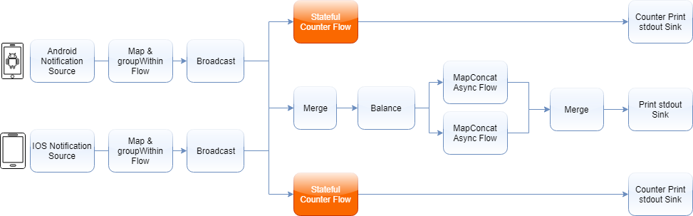
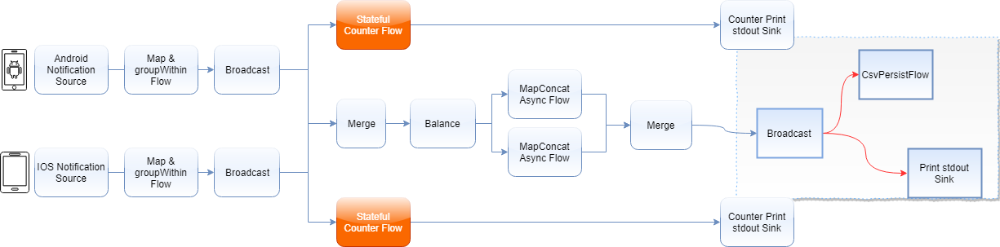

# word-indicator

Until Akka meet IOT, the back-pressure come into focus. here provide an example as "word indicator" that using the data-flow which tell me there's multi demension we can analyz the message(maybe is a cvs data, a device vin message, a protocol, or some kind of serialized message).

## Architecture

We will simulate an environment in which we would get notifications from Android and IOS phones. We will map each notification to `GenericMsg` class and use it to count them separately with our stateful counter flows.

## flexible & alternative

As you wish, we hope that we can persist/analysis the message but will not pollution the original sources.

## Summary

Dont use akka streams in the situation that no focused on data processing. which means that the valuable exceptions will be swallowed or make back-pressure. on the other hand, akka streams only be suitable for data process like data transform, large-scaled dataset analysis, device message collecting, and so on.